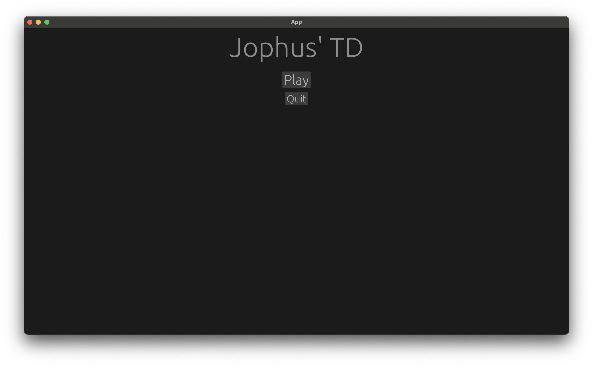
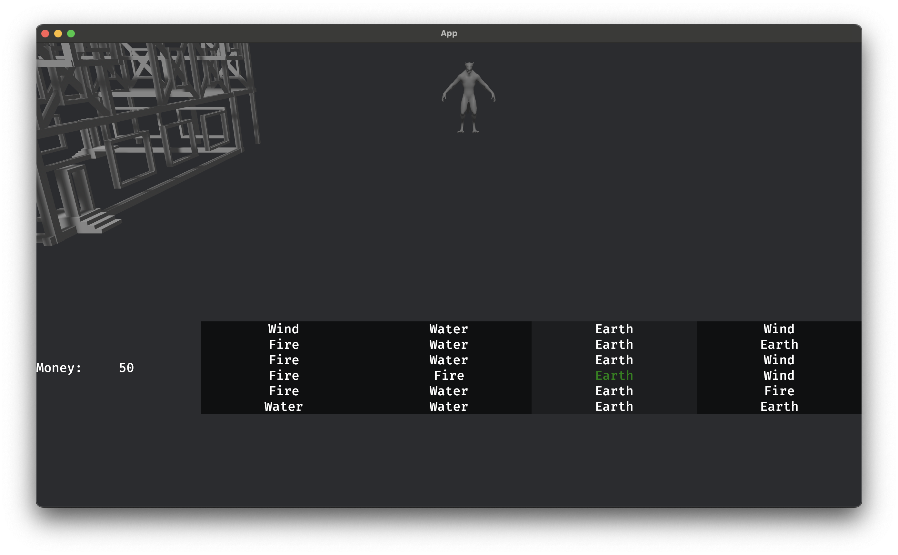

# td

[](https://github.com/alexanderjophus/td/actions/workflows/release.yaml)

Started life as a pokemon tower defense game. Now it's just a tower defense game.

## Getting Started

Clone (and make sure you've clone the lfs files too (glb et al)).

Then

```bash
cargo run
```

There's a feature flag for debug `--features debug` which will show the grid and other helpful things.

## Features

- Grid based system
- Towers are obstacles the enemy must be able to navigate around
- Moddable towers/enemies. i.e. a ron file that points to new valid glb files, with all the towers config done.

## Screenshots

These will get out of date quickly as I iterate on the game.

Splash screen



Shop screen, select what die to buy.



## Credits

Check [credits](assets/credits.md) for more details.
